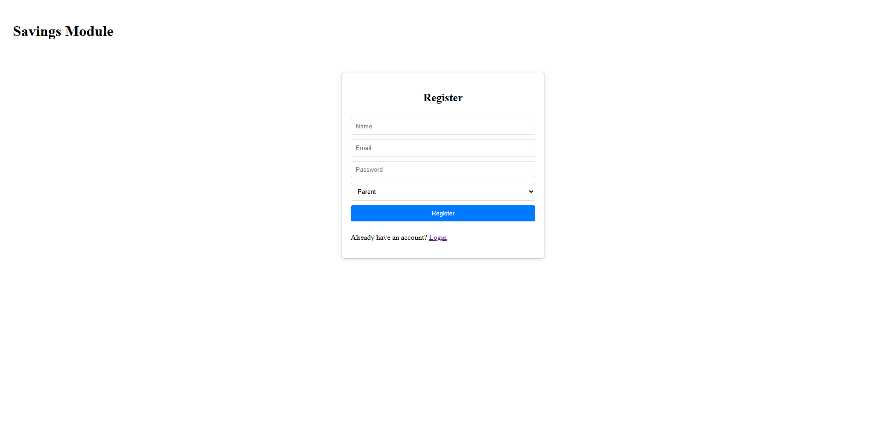

# Savings Module Prototype

## Overview

This MERN stack prototype implements a savings flow for parents with analytics dashboard. Features include registration, goal creation, deposits/withdrawals, ledger, and admin dashboard with charts (using Recharts), funnel, trends, top savers, and nudge list.

## How to Run

### Backend:

- `cd backend`
- `npm install`
- Create `.env` with `MONGO_URI=mongodb://localhost:27017/savingsdb` and `JWT_SECRET=secret`
- Start MongoDB locally.
- `npm run dev`

### Frontend:

- `cd frontend`
- `npm install`
- `npm start`

Access at http://localhost:3000. Login as admin (register with role 'admin') to see dashboard.

## Sample Dataset

Seed data via backend (add to index.js for dev). This populates the database with sample users, goals, and transactions (events). Events are tracked via the Transaction model, simulating real user interactions like registrations (as 'registration' events), goal creations, deposits, and withdrawals.

### DB Seed Script (MongoDB)

Add this to your backend's `index.js` after `connectDB()` and call `seedData()` once for initialization. It creates:

- 10 users (including admin).
- 7 goals linked to users.
- 10 registration events, 7 goal creation events, 5 deposit events, 2 withdrawal events.

```javascript
// Example seed in index.js after connectDB
const seedData = async () => {
  try {
    // Clear existing data (optional for dev)
    await User.deleteMany({});
    await Goal.deleteMany({});
    await Transaction.deleteMany({});

    // Create 10 sample users (parents + admin)
    const users = await User.insertMany([
      { name: 'Admin', email: 'admin@test.com', password: 'password', role: 'admin' }, // Hashed in model
      { name: 'Parent A', email: 'parenta@test.com', password: 'password', role: 'parent' },
      { name: 'Parent B', email: 'parentb@test.com', password: 'password', role: 'parent' },
      { name: 'Parent C', email: 'parentc@test.com', password: 'password', role: 'parent' },
      { name: 'Parent D', email: 'parentd@test.com', password: 'password', role: 'parent' },
      { name: 'Parent E', email: 'parente@test.com', password: 'password', role: 'parent' },
      { name: 'Parent F', email: 'parentf@test.com', password: 'password', role: 'parent' },
      { name: 'Parent G', email: 'parentg@test.com', password: 'password', role: 'parent' },
      { name: 'Parent H', email: 'parenth@test.com', password: 'password', role: 'parent' },
      { name: 'Parent I', email: 'parenti@test.com', password: 'password', role: 'parent' }
    ]);

    // Create 7 sample goals
    const goals = await Goal.insertMany([
      { userId: users[1]._id, name: 'College Fund', targetAmount: 5000, currentAmount: 0 },
      { userId: users[2]._id, name: 'Vacation Savings', targetAmount: 2000, currentAmount: 0 },
      { userId: users[3]._id, name: 'Emergency Fund', targetAmount: 1000, currentAmount: 0 },
      { userId: users[4]._id, name: 'Toy Fund', targetAmount: 500, currentAmount: 0 },
      { userId: users[5]._id, name: 'Education', targetAmount: 3000, currentAmount: 0 },
      { userId: users[6]._id, name: 'Car Savings', targetAmount: 4000, currentAmount: 0 },
      { userId: users[7]._id, name: 'Home Improvements', targetAmount: 1500, currentAmount: 0 }
    ]);

    // Create sample transactions (events): 10 registrations, 7 goals, 5 deposits, 2 withdrawals
    // Assuming Transaction model has fields: type, userId, goalId (optional), amount, status, date
    const transactions = await Transaction.insertMany([
      // 10 Registration events (one per user, including admin)
      { type: 'registration', userId: users[0]._id, amount: 0, status: 'completed', date: new Date('2025-08-01') },
      { type: 'registration', userId: users[1]._id, amount: 0, status: 'completed', date: new Date('2025-08-02') },
      { type: 'registration', userId: users[2]._id, amount: 0, status: 'completed', date: new Date('2025-08-03') },
      { type: 'registration', userId: users[3]._id, amount: 0, status: 'completed', date: new Date('2025-08-04') },
      { type: 'registration', userId: users[4]._id, amount: 0, status: 'completed', date: new Date('2025-08-05') },
      { type: 'registration', userId: users[5]._id, amount: 0, status: 'completed', date: new Date('2025-08-06') },
      { type: 'registration', userId: users[6]._id, amount: 0, status: 'completed', date: new Date('2025-08-07') },
      { type: 'registration', userId: users[7]._id, amount: 0, status: 'completed', date: new Date('2025-08-08') },
      { type: 'registration', userId: users[8]._id, amount: 0, status: 'completed', date: new Date('2025-08-09') },
      { type: 'registration', userId: users[9]._id, amount: 0, status: 'completed', date: new Date('2025-08-10') },
      // 7 Goal creation events
      { type: 'goal_created', userId: users[1]._id, goalId: goals[0]._id, amount: 0, status: 'completed', date: new Date('2025-08-11') },
      { type: 'goal_created', userId: users[2]._id, goalId: goals[1]._id, amount: 0, status: 'completed', date: new Date('2025-08-12') },
      { type: 'goal_created', userId: users[3]._id, goalId: goals[2]._id, amount: 0, status: 'completed', date: new Date('2025-08-13') },
      { type: 'goal_created', userId: users[4]._id, goalId: goals[3]._id, amount: 0, status: 'completed', date: new Date('2025-08-14') },
      { type: 'goal_created', userId: users[5]._id, goalId: goals[4]._id, amount: 0, status: 'completed', date: new Date('2025-08-15') },
      { type: 'goal_created', userId: users[6]._id, goalId: goals[5]._id, amount: 0, status: 'completed', date: new Date('2025-08-16') },
      { type: 'goal_created', userId: users[7]._id, goalId: goals[6]._id, amount: 0, status: 'completed', date: new Date('2025-08-17') },
      // 5 Deposit events
      { type: 'deposit', userId: users[1]._id, goalId: goals[0]._id, amount: 100, status: 'completed', date: new Date('2025-09-01') },
      { type: 'deposit', userId: users[2]._id, goalId: goals[1]._id, amount: 200, status: 'completed', date: new Date('2025-09-02') },
      { type: 'deposit', userId: users[3]._id, goalId: goals[2]._id, amount: 50, status: 'completed', date: new Date('2025-09-03') },
      { type: 'deposit', userId: users[4]._id, goalId: goals[3]._id, amount: 150, status: 'completed', date: new Date('2025-09-04') },
      { type: 'deposit', userId: users[5]._id, goalId: goals[4]._id, amount: 300, status: 'completed', date: new Date('2025-09-05') },
      // 2 Withdrawal events (one pending, one approved)
      { type: 'withdrawal', userId: users[1]._id, goalId: goals[0]._id, amount: 50, status: 'pending', date: new Date('2025-09-10') },
      { type: 'withdrawal', userId: users[2]._id, goalId: goals[1]._id, amount: 100, status: 'approved', date: new Date('2025-09-11') }
    ]);

    console.log('Sample data seeded successfully!');
  } catch (error) {
    console.error('Error seeding data:', error);
  }
};

// Call once: seedData();
```

**Notes on Seed Script**:
- Assumes your models (`User`, `Goal`, `Transaction`) have the fields used (e.g., `userId` as ObjectId ref, `password` will be hashed by the model).
- Dates are in 2025 for relevance to current date (Sep 12, 2025); adjust as needed.
- Run only in dev; remove or comment out in production.

### Sample Dataset with Events (CSV)

This CSV represents the same events as above, exportable from MongoDB or importable via `mongoimport --type csv -c transactions --headerline --file sample-events.csv`. It includes all 24 events (10 reg + 7 goals + 5 dep + 2 wd). Save as `sample-events.csv`:

```
_id,type,userId,goalId,amount,status,date
1,registration,admin@test.com,,0,completed,2025-08-01T00:00:00Z
2,registration,parenta@test.com,,0,completed,2025-08-02T00:00:00Z
3,registration,parentb@test.com,,0,completed,2025-08-03T00:00:00Z
4,registration,parentc@test.com,,0,completed,2025-08-04T00:00:00Z
5,registration,parentd@test.com,,0,completed,2025-08-05T00:00:00Z
6,registration,parente@test.com,,0,completed,2025-08-06T00:00:00Z
7,registration,parentf@test.com,,0,completed,2025-08-07T00:00:00Z
8,registration,parentg@test.com,,0,completed,2025-08-08T00:00:00Z
9,registration,parenth@test.com,,0,completed,2025-08-09T00:00:00Z
10,registration,parenti@test.com,,0,completed,2025-08-10T00:00:00Z
11,goal_created,parenta@test.com,goal1,0,completed,2025-08-11T00:00:00Z
12,goal_created,parentb@test.com,goal2,0,completed,2025-08-12T00:00:00Z
13,goal_created,parentc@test.com,goal3,0,completed,2025-08-13T00:00:00Z
14,goal_created,parentd@test.com,goal4,0,completed,2025-08-14T00:00:00Z
15,goal_created,parente@test.com,goal5,0,completed,2025-08-15T00:00:00Z
16,goal_created,parentf@test.com,goal6,0,completed,2025-08-16T00:00:00Z
17,goal_created,parentg@test.com,goal7,0,completed,2025-08-17T00:00:00Z
18,deposit,parenta@test.com,goal1,100,completed,2025-09-01T00:00:00Z
19,deposit,parentb@test.com,goal2,200,completed,2025-09-02T00:00:00Z
20,deposit,parentc@test.com,goal3,50,completed,2025-09-03T00:00:00Z
21,deposit,parentd@test.com,goal4,150,completed,2025-09-04T00:00:00Z
22,deposit,parente@test.com,goal5,300,completed,2025-09-05T00:00:00Z
23,withdrawal,parenta@test.com,goal1,50,pending,2025-09-10T00:00:00Z
24,withdrawal,parentb@test.com,goal2,100,approved,2025-09-11T00:00:00Z
```

**Notes on CSV**:
- `_id` is a simple sequential ID (replace with ObjectIds in DB).
- `userId` and `goalId` use email/slug for simplicity; map to actual IDs in import script.
- Timestamps in ISO format for easy import.
- This dataset enables testing analytics (e.g., 5 active parents with deposits in Sep, avg deposit ~160, etc.).

## Analytics Calculations

- **Active Parents**: Users with ≥1 deposit this month.
- **Deposit Success Rate**: (Successful deposits / Total attempts) * 100 (mock 10% fail).
- **Avg Deposit Size/Frequency**: Mean amount and deposits per user this month.
- **Withdrawal Ratio**: Total approved withdrawals / Total deposits.
- **Funnel**: Counts of events this month.
- **Daily Trend**: Aggregated deposits by date (last 30 days).
- **Top Savers**: Top 5 users by deposit frequency this month.
- **Nudge List**: Parents with no deposits in 21 days.

## Screenshots

### Dashboard
Shows totals, funnel bar chart (drop-offs visible), line chart for trends, tables for top savers/nudges, pending withdrawals with approve/reject.


### Pending Withdrawals
Shows pending withdrawals with approve/reject buttons.


### Registration Form
Simple form for user registration.



### Login Form
Simple form for user login.


### Goal Creation Form
Form for creating a savings goal.


### Deposit Form
Form for making a deposit.


### Withdrawal Form
Form for requesting a withdrawal, including pending withdrawals table with modal confirmation.


### Ledger Table
Table showing transaction history.


## Scalability Notes

- Use aggregation pipelines for analytics (efficient for MongoDB).
- Add pagination for large datasets.
- Real M-Pesa integration via API.
- Email/SMS via Twilio/SendGrid for nudges.


# Savings Module Technical Documentation

## Overview
The Savings Module is a full-stack application designed to manage savings goals and transactions with robust admin controls and data integrity features.

## Setup

### Prerequisites
- Node.js (v14 or higher)
- MongoDB
- npm or yarn

### Installation
1. Clone the repository
2. Install server dependencies:
   ```bash
   cd server
   npm install
   ```
3. Install client dependencies:
   ```bash
   cd client
   npm install
   ```

### Environment Configuration
Create a .env file in the server directory with the following variables:
```
PORT=5000
MONGODB_URI=your_mongodb_connection_string
JWT_SECRET=your_jwt_secret
```

## Core Features

### 1. Transaction Processing
- **Idempotency**: Implemented using unique idempotency keys for transactions
  - Required for all deposit and withdrawal requests
  - Prevents duplicate transactions even on network failures
  - Keys are stored in the Transaction model

### 2. Data Integrity
- **Reconciliation System**:
  - Balance verification between transactions and goals
  - Duplicate transaction detection
  - Transaction integrity checks (no negative balances)
  - Automated health checks via API endpoint

### 3. Admin Controls
- **Transaction Management**:
  - View all transactions
  - Approve/reject withdrawal requests
  - Transaction history with filtering
  - System health monitoring

- **Access Levels**:
  - Admin: Full access to all features
  - Manager: Can manage transactions
  - User: Basic features only

## API Endpoints

### Authentication
- POST /api/auth/register
- POST /api/auth/login

### Transactions
- POST /api/transactions/deposit
- POST /api/transactions/withdrawal
- GET /api/transactions/ledger
- GET /api/transactions/ledger/all (admin)
- GET /api/transactions/withdrawals/pending (admin)
- PUT /api/transactions/withdrawal/:id (admin)

### Reconciliation
- GET /api/reconciliation/check (admin)

## Security Assumptions

1. **Authentication**:
   - JWT-based authentication
   - Tokens expire after 24 hours
   - Refresh tokens not implemented (requires re-login)

2. **Authorization**:
   - Role-based access control
   - Middleware checks on all protected routes
   - Admin privileges verified per-request

3. **Data Validation**:
   - Input validation on all API endpoints
   - Amount validation for transactions
   - Balance checks before withdrawals

## Error Handling

1. **Transaction Failures**:
   - Failed transactions marked accordingly
   - Automatic rollback of incomplete transactions
   - Error logging and monitoring

2. **Duplicate Prevention**:
   - Idempotency keys required for all transactions
   - Unique constraint enforcement
   - Conflict resolution procedures

## Monitoring and Maintenance

1. **Health Checks**:
   - Automated balance reconciliation
   - Duplicate transaction detection
   - System integrity verification

2. **Administration**:
   - Admin dashboard for monitoring
   - Transaction approval workflow
   - User management interface

## Future Improvements

1. **Scalability**:
   - Implement caching for frequently accessed data
   - Add database indexing for better performance
   - Consider message queue for transaction processing

2. **Security**:
   - Add rate limiting
   - Implement refresh tokens
   - Add audit logging

3. **Features**:
   - Batch transaction processing
   - Enhanced reporting capabilities
   - Real-time notifications

## Support and Troubleshooting

Common issues and solutions:
1. Transaction Failures
   - Check idempotency key implementation
   - Verify database connection
   - Review transaction logs

2. Balance Discrepancies
   - Run reconciliation check
   - Review transaction history
   - Check for failed transactions

3. Admin Access Issues
   - Verify user role assignments
   - Check token expiration
   - Review middleware logs


## Competitive Analysis: Chumz vs Nissmart Savings

### Feature Comparison Table

| Feature Category | Chumz | Nissmart |
|-----------------|-------|-----------|
| **User Experience** | ✓ Simple 3-step onboarding<br>✓ Mobile-first design<br>✓ Direct mobile money integration<br>✓ Clean interface | ✓ Advanced features with maintained simplicity<br>✓ Flexible goal customization<br>✓ Detailed transaction insights<br>✓ Multiple visualization options |
| **Goal Management** | ✓ Predefined templates<br>✓ Basic progress tracking<br>✓ Fixed saving rules<br>× Limited customization | ✓ Custom goal creation<br>✓ Advanced progress analytics<br>✓ Flexible saving rules<br>✓ Predictive goal tracking |
| **Analytics** | × Basic reporting<br>× Limited insights<br>× Minimal predictions<br>× Fixed reports | ✓ Real-time analytics<br>✓ Predictive analysis<br>✓ Customizable reporting<br>✓ Behavioral insights |
| **Administration** | × Basic admin panel<br>× Limited controls<br>× Simple reconciliation<br>× Basic transaction view | ✓ Multi-tier admin controls<br>✓ Advanced monitoring<br>✓ Sophisticated reconciliation<br>✓ Detailed audit trails |
| **Security** | ✓ Standard security<br>✓ Regulatory compliance<br>× Basic transaction validation<br>× Limited fraud detection | ✓ Idempotency handling<br>✓ Advanced fraud detection<br>✓ Automated reconciliation<br>✓ Comprehensive validation |
| **Social Features** | ✓ Group savings<br>✓ Savings challenges<br>✓ Community engagement<br>✓ User testimonials | ○ Planned for future<br>○ Focus on enterprise features<br>○ Team collaboration tools<br>○ Administrative groups |
| **Market Position** | ✓ 150,000+ users<br>✓ Consumer focus<br>✓ Mobile money integration<br>✓ CMA compliance | ✓ Enterprise-ready<br>✓ Advanced features<br>✓ Scalable architecture<br>✓ Data-driven approach |

Legend:
- ✓ Available feature
- × Missing/Limited feature
- ○ Planned/In development

### Key Differentiators for Nissmart

1. **Enterprise Focus**
   - Scalable infrastructure for large organizations
   - Comprehensive administrative controls
   - Detailed compliance reporting
   - Advanced security features

2. **Technical Advantages**
   - Real-time data processing
   - Advanced analytics engine
   - Robust reconciliation system
   - Comprehensive audit trails

3. **Strategic Value**
   - Data-driven decision making
   - Predictive analytics
   - Flexible customization
   - Enterprise-grade reliability

Through this comparison, Nissmart positions itself as the enterprise-ready savings platform, offering advanced features while maintaining user-friendly aspects. The focus on analytics, administration, and data integrity creates a distinct value proposition for organizations needing sophisticated savings management capabilities.
